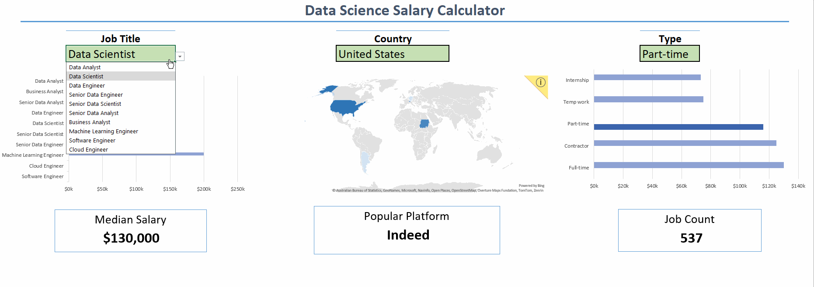

# Salary Dashboard

# Introduction
Data jobs salary dashboard from the data set provided by ##luke##, which includes job title,salary, location, date posted, type and skills to help job seekers get a good idea of the job market.


# Dashboard
## 🔬Formulas and Functions
### 💰 Median salary by job title
```
=MEDIAN(
  IF(
    (jobs[job_title_short]=title)*
    (jobs[salary_year_avg]<>0)*
    (jobs[job_country] = country)*
    (jobs[job_schedule_type] = B2),
    jobs[salary_year_avg]
  )
)
```
- 🔍 Multi-Criteria Filtering: Checks job title, country, schedule type, and excludes blank salaries.
- 📊 Array Formula: Utilizes MEDIAN() function with nested IF() statement to analyze an array.
- 🎯 Tailored Insights: Provides specific salary information for job titles, regions, and schedule types.
- 🔢 Formula Purpose: This formula populates the table below, returning the median salary based on job title, country, and type specified.
### 📋 Background Table


### 📉 Dashboard Implementation


## 📈 Graphs
### 🌐 Map

### 📊 Job Salaries Bar Chart


### 🏢 Job Type Bar Chart


## ❎ Data Validation
🔍 Filtered List  
🔒 Enhanced Data Validation: Implementing the filtered list as a data validation rule under the Job Title, Country, and Type option in the Data tab ensures:  
🎯 User input is restricted to predefined, validated schedule types  
🚫 Incorrect or inconsistent entries are prevented  
👥 Overall usability of the dashboard is enhanced  


# Dataset

Dataset provided by [Luke Barousse](https://www.youtube.com/@LukeBarousse), which includes:  
-👨‍💼 Job Title  
-💵 Salary  
-🤹‍♂️ Skills  
-📍  Location  
-🌎 Job Platform  

